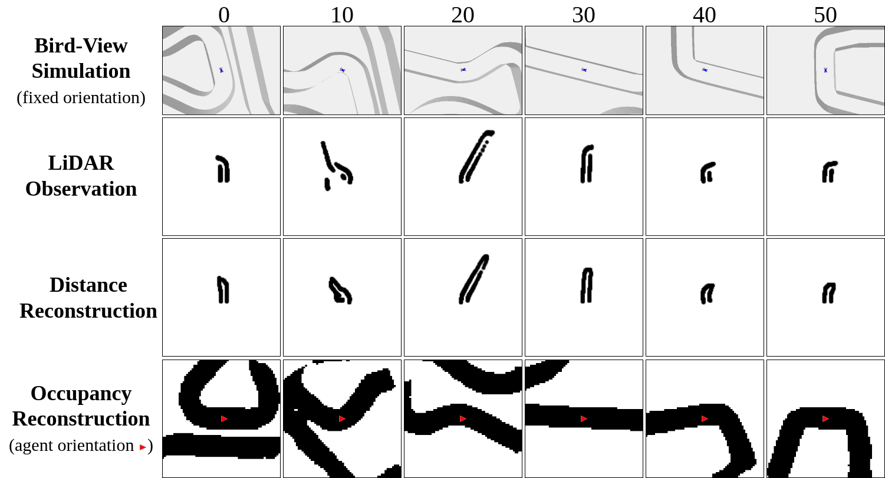

# Latent Imagination Facilitates Zero-Shot Transfer in Autonomous Racing

We train a model-based RL agent in simulation and, without finetuning, transfer it to small-scale race cars.


Paper is available [on arXiv](https://arxiv.org/abs/2103.04909).


This repository is organized as follows:
- Folder `dreamer` contains the code related to the Dreamer agent.
- Folder `baselines` contains the code related to the Model Free algorihtms (D4PG, MPO, PPO, LSTM-PPO, SAC).
- Folder `ros_agent` contains the code related to the transfer on real racing cars.
- Folder `docs` contains the track maps, mechanical and general documentation.


# Dreamer

>*"Dreamer learns a world model that predicts ahead in a compact feature space.
From imagined feature sequences, it learns a policy and state-value function.
The value gradients are backpropagated through the multi-step predictions to
efficiently learn a long-horizon policy."*

This implementation extends the original implementation of [Dreamer (Hafner et al. 2019)](https://github.com/danijar/dreamer). 

We refer the reader to the [Dreamer website](https://danijar.com/project/dreamer/) for the details on the algorithm.


## Instructions

This code has been tested on `Ubuntu 18.04` with `Python 3.7`.
 
Get dependencies:

```
pip install --user -r requirements.txt
```

### Training

We train Dreamer on LiDAR observations and propose two Reconstruction variants: LiDAR and Occupancy Map.



Train the agent with LiDAR reconstruction:

```
python dreamer/dream.py --track columbia --obs_type lidar
```

Train the agent with Occupancy Map reconstruction:
```
python dream.py --track columbia --obs_type lidar_occupancy
```

Please, refer to `dream.py` for the other command-line arguments.

### Offline Evaluation
The evaluation module runs offline testing of a trained agent (Dreamer, D4PG, MPO, PPO, SAC).

To run evaluation, assuming to have the `dreamer` directory in the `PYTHONPATH`:
```
python evaluations/run_evaluation.py --agent dreamer \
                                     --trained_on austria \
                                     --obs_type lidar \
                                     --checkpoint_dir logs/checkpoints \
                                     --outdir logs/evaluations \
                                     --eval_episodes 10 \
                                     --tracks columbia barcelona 
```
The script will look for all the checkpoints with pattern `logs/checkpoints/austria_dreamer_lidar_*`
The checkpoint format depends on the saving procedure (`pkl`, `zip` or directory).

The results are stored as tensorflow logs.

## Plotting
The plotting module containes several scripts to visualize the results, usually aggregated over multiple experiments.

To plot the learning curves:
```
python plotting/plot_training_curves.py --indir logs/experiments \
                                                --outdir plots/learning_curves \
                                                --methods dreamer mpo \
                                                --tracks austria columbia treitlstrasse_v2 \
                                                --legend
```
It will produce the comparison between Dreamer and MPO on the tracks Austria, Columbia, Treitlstrasse_v2.

To plot the evaluation results:
```
python plotting/plot_test_evaluation.py --indir logs/evaluations \
                                                --outdir plots/evaluation_charts \
                                                --methods dreamer mpo \
                                                --vis_tracks austria columbia treitlstrasse_v2 \
                                                --legend
```
It will produce the bar charts comparing Dreamer and MPO evaluated in Austria, Columbia, Treitlstrasse_v2.


## Instructions with Docker

We also provide an docker image based on `tensorflow:2.3.1-gpu`.
You need `nvidia-docker` to run them, see  for more details.

To build the image:
```  
docker build -t dreamer .
```

To train Dreamer within the container:
```
docker run -u $(id -u):$(id -g) -v $(pwd):/src --gpus all --rm dreamer python dream.py --track columbia --steps 1000000
```


# Model Free

The organization of Model-Free codebase is similar and we invite the users 
to refer to the [README](baselines/README.md) for the detailed instructions.


# Hardware

The codebase for the implementation on real cars is contained in `ros_agent`.

Additional material:
* Folder `docs/maps` contains a collection of several tracks to be used in [F1Tenth](https://f1tenth.org/) races.
* Folder `docs/mechanical` contains support material for real world race-tracks.

# Citation
If you find this work useful for your own ideas, please cite our paper:
```
@misc{brunnbauer2022latent,
      title={Latent Imagination Facilitates Zero-Shot Transfer in Autonomous Racing}, 
      author={Axel Brunnbauer and Luigi Berducci and Andreas Brandstätter and Mathias Lechner and Ramin Hasani and Daniela Rus and Radu Grosu},
      year={2022},
      eprint={2103.04909},
      archivePrefix={arXiv},
      primaryClass={cs.LG}
}
```
