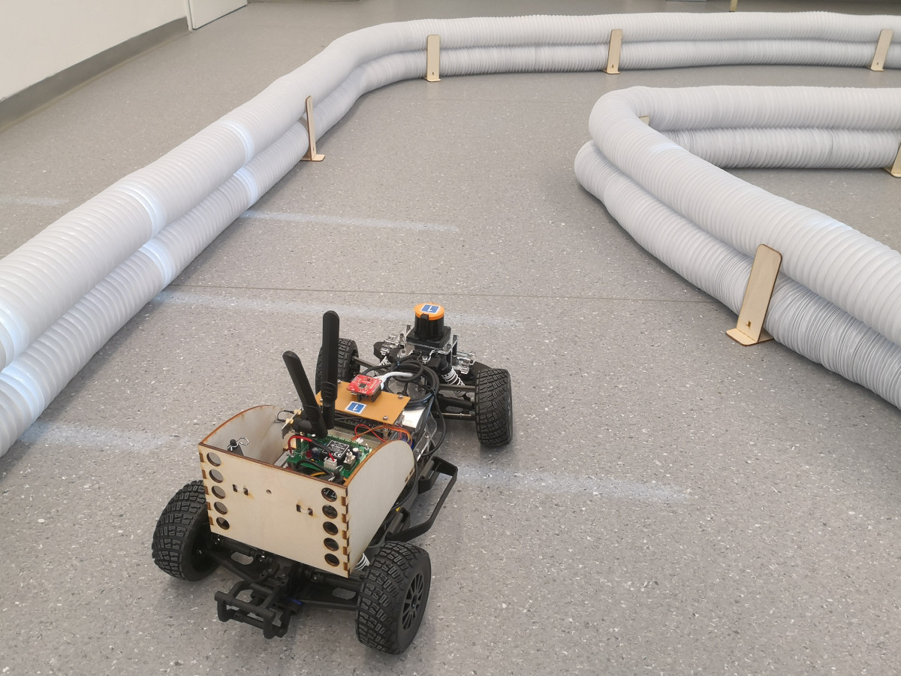

# Race-Track

Mechanical support material for race-tracks to be used for [f1tenth](https://f1tenth.org/)-style racings.

## Components
* Flexible air tubes: [Xavax 00110973 - 12 m x 102 mm Wäschetrockner-Abluftschlauch Weiß](https://www.conrad.at/de/p/xavax-00110973-12-m-x-102-mm-waeschetrockner-abluftschlauch-weiss-666816.html)
* Connectors (see folder `Race-Track-Connector`)
* U-shaped stands (see folder `Race-Track-Stand`)

