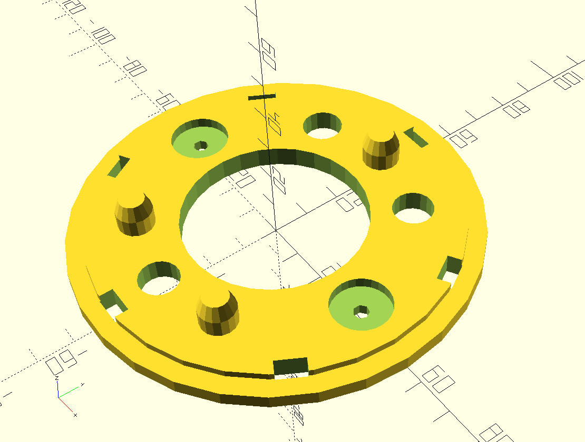
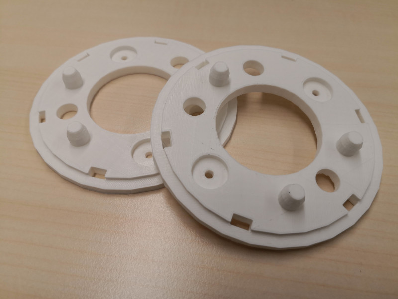
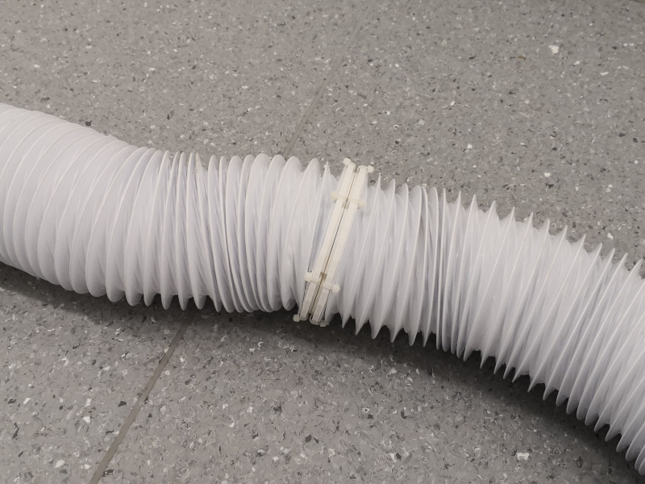

# Connectors for Race-Track Barrier

3D-printed connector for flexible air tubes with magnetic coupling function.

## 3D-Print file
* The connector is constructed using [OpenSCAD](https://www.openscad.org/): `connector1.scad`
* The model is already sliced for [Prusa i3 MK3S](https://shop.prusa3d.com/de/51-original-prusa-i3-mk3s): `connector1_0.15mm_PLA_MK3S_6h27m_2parts-25infill.gcode.xz`

## other Components
* Magnets: [TRU COMPONENTS D15T3-M4 Permanent-Magnet Ring (Ø x H) 15 mm x 3 mm N35](https://www.conrad.at/de/p/tru-components-d15t3-m4-permanent-magnet-ring-x-h-15-mm-x-3-mm-n35-grenztemperatur-max-80-c-1568108.html)
* Screws: [TOOLCRAFT TO-5452194 Senkschrauben M4 12 mm Schlitz ISO 2009 Polyamid](https://www.conrad.at/de/p/toolcraft-to-5452194-senkschrauben-m4-12-mm-schlitz-iso-2009-polyamid-200-st-1817398.html)
* Nuts: [TOOLCRAFT 815977 Sechskantmuttern M4 Kunststoff](https://www.conrad.at/de/p/toolcraft-815977-sechskantmuttern-m4-kunststoff-10-st-815977.html)
* Zip-Ties: [TRU COMPONENTS 1577951 Kabelbinder 150 mm 2.60 mm Weiß](https://www.conrad.at/de/p/tru-components-1577951-kabelbinder-150-mm-2-60-mm-weiss-hitzestabilisiert-100-st-1577951.html)

## Pictures

3D-printed connector detail:

Two connected flexible air tubes:

